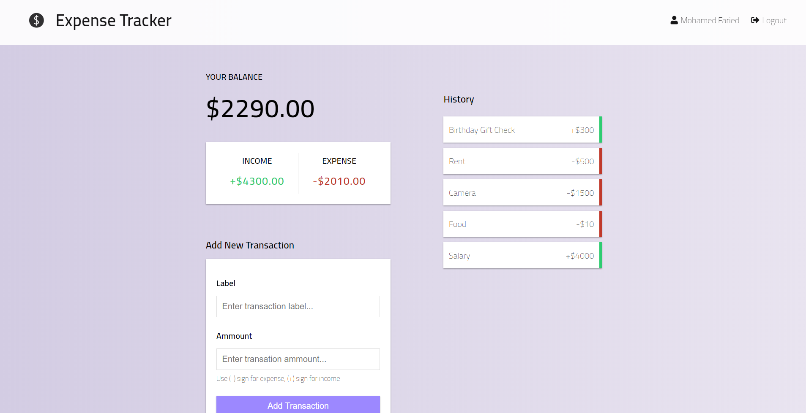

# 📐 Expense Tracker Web App (A demo application built using MERN full stack technologies)

Expense Tracker is a web application which enables users to track their income and expenses and gives them a summary about their cash flow.

## 💻 Technologies:

* REACT framework for creating the clinet/front-end of the application. The react application used context api to manage the global state of the application.

* Node.js & ExpressJS for creating the back-end API which controls the CRUD operations of the data and handles user authentication and session.

* Cloud version of MongoDB using Atlas interface which was handled in the application using mongoose npm module.

* jsonwebtoken to manage user sessions and authentications based on tokens.

* express-validation to validate api calls.

## 📷 Preview:
 

    
     
    

